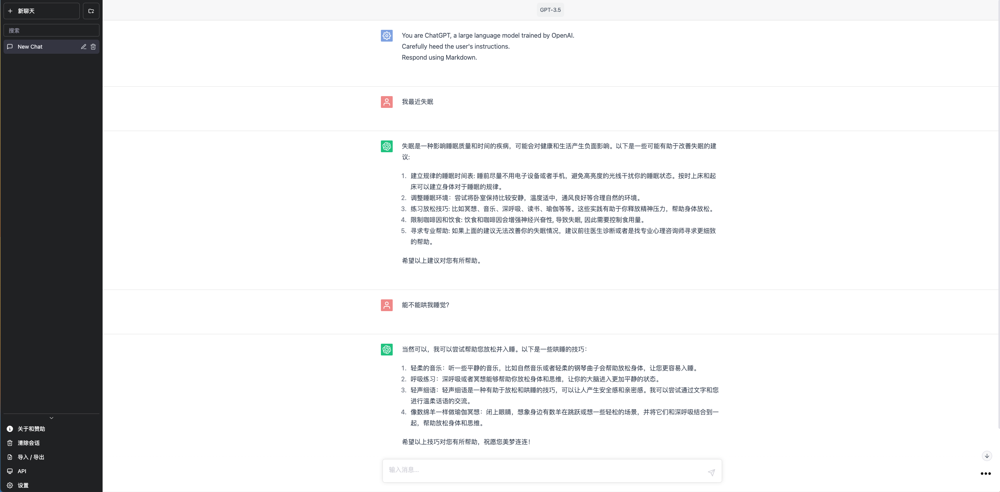
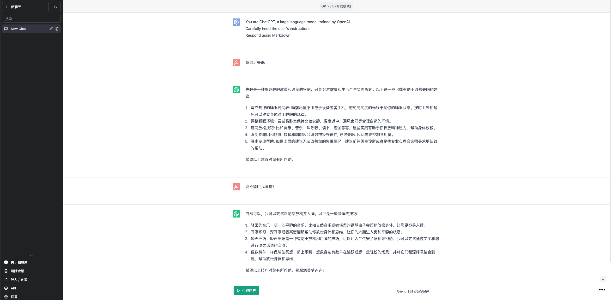

<h1 align="center"><b>BreezeGPT</b></h1>

    

<h4 align="center"><b>更加顺滑、自然的ChatGPT使用界面</b></h4>

    <a href="https://breezegpt.dev">Demo网站</a>
    ·
    <a href="https://github.com/quentinzhang/BreezeGPT/issues">反馈问题</a>

## 项目由来

“工欲善其事，必先利其器”。由于工作的关系，我需要经常做提示语（Prompt）的调试，也一直在寻找好用的Prompt开发工具。偶然的机会我发现了[Better ChatGPT](https://github.com/ztjhz/BetterChatGPT/tree/main)这个优秀的开源项目，它包含了一些Chat原生界面所没有的feature，比如在对话的任意位置上插入System角色的content，为我的日常工作提供了更大的灵活性。

不过我在使用Better ChatGPT的过程中，觉得它的交互界面用起来不太顺手，于是我的强迫症犯了，决定自己动手在Better ChatGPT的代码基础上进行一些二次开发，目标是创造一个更加自然、友好的ChatGPT使用界面。

我一直认为：好的工具不仅能够带给人们效率的提升，而且还可以让人感到身心舒爽。所以我给这个开源项目起了BreezeGPT这个有点骚气的名字——希望带给每个人轻风拂面一般顺滑、自然的ChatGPT使用体验。

## 功能

BreezeGPT最大程度上保持了Better ChatGPT的特色功能，包括：

- 支持使用内置代理解決 ChatGPT 地区限制
- 支持自定义提示词资料库
- 支持使用文件夹（且带颜色）整理聊天
- 支持筛选聊天和文件夹
- 支持实时计算 token 数量和价格
- 支持使用 ShareGPT 分享聊天
- 支持自定义 API 参数（例如存在惩罚）
- 支持自定义用户/助理/系统身份
- 支持任意编辑/插入/调整消息顺序
- 支持自动生成聊天标题
- 支持自动保存聊天记录
- 支持导入/导出聊天记录
- 支持将聊天保存为 Markdown/图片/JSON
- 支持与 Google Drive 同步
- 支持 Azure OpenAI 终端
- 支持多语言 (i18n)

更详细的功能介绍请移步：https://github.com/ztjhz/BetterChatGPT/blob/main/README-zh_CN.md

## 界面优化

与此同时，BreezeGPT在ChatGPT的UI界面上做出了很多调整和尝试。首先，我认为产品应该有清晰、明确的受众。所以我将原版中的“高级模式”改为“开发模式”，以此对标ChatGPT的Playground，满足开发者调试Prompt的所追求的灵活与高效。而常规模式则对标原生ChatGPT的聊天界面，设计目标是简洁、易用。这两个模式下的功能与UI也依据此思路做了很多调整。

| 常规聊天模式 | Prompt开发模式 |
|:---:|:---:|
|  |  |

以下是具体的UI改进列表：

### 适用于开发模式：
- 增加编辑Prompt的过程的自动保存，不必再担心消息丢失
- 可以通过点击头像更方便的切换角色（通常可以比点击下拉菜单的方式更少点击实现目的）
- 删除对话消息更加智能，空消息一键删除无需确认
- 可通过单击消息和其他内容区域一键进入和退出消息编辑模式
- 弱化了在对话中间插入消息的入口
- 将生成回复的按钮统一放在页面底部，增加了界面的稳定一致性

### 适用于常规模式：
- 将撰写和发送消息的功能区固定在页面底部，而不是随页面内容滚动
- 删繁就简，对一些日常聊天对话中不常用的功能做了舍弃，比如：
  - 去掉了对话消息通过上下移动自由排序的功能
  - 去掉了在对话中间插入消息的功能
  - 去掉了随意切换对话角色的功能
  - 去掉了在对话最上方插入系统角色的功能

### 适用于两种模式：
- 可以通过assistant用户图标的颜色区分是GPT-3.5还和GPT-4
- 将分享、下载、复制对话等不常用的操作折叠放在右下角的Speed Dial菜单中

## 运行项目

1. 确保您已安装以下内容：

   - [node.js](https://nodejs.org/en/)
   - [yarn](https://yarnpkg.com/) 或者 [npm](https://www.npmjs.com/)

2. 通过运行 `git clone https://github.com/quentinzhang/BreezeGPT.git` 克隆此[存储库](https://github.com/ztjhz/BetterChatGPT)。
3. 进入目录通过 `cd BetterChatGPT`
4. 运行 `yarn` 或 `npm install`，具体取决于您是否安装了 yarn 或 npm。
5. 运行 `yarn dev` 或 `npm run dev` 来启动应用程序。
6. 运行 `yarn build` 或 `npm run build` 为生产环境生成编译文件

## 使用方法

- 首次使用时，需要您输入OpenAI的API Key [获取](https://platform.openai.com/account/api-keys)
- 你还可以选择使用自己的API端点代理

## ⭐️ 支持和鼓励

<h3 align="center">
    给 <b>BreezeGPT</b> 一颗星星 ⭐️，给我一点鼓励与动力❤️
</h3>